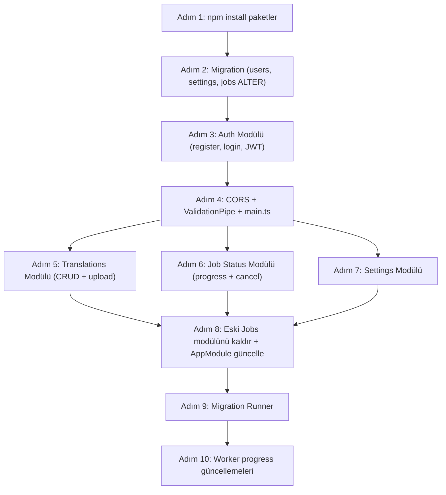

# Glyphany-Translate Backend — Kapsamlı Adım Adım İmplementasyon Planı

## Mevcut Durum Analizi

### ✅ Backend'de Halihazırda Var Olanlar (glyphany-api)
| Modül | Durum | Dosya |
|---|---|---|
| NestJS iskeleti | ✅ Kurulu | [app.module.ts](file:///c:/Users/MrMahirr/Desktop/Projeler/Glyphany-translate/glyphany-api/src/app.module.ts) |
| Database modülü (raw SQL, `pg` Pool) | ✅ Çalışıyor | [database.service.ts](file:///c:/Users/MrMahirr/Desktop/Projeler/Glyphany-translate/glyphany-api/src/database/database.service.ts) |
| Storage modülü (MinIO/S3) | ✅ Çalışıyor | [storage.service.ts](file:///c:/Users/MrMahirr/Desktop/Projeler/Glyphany-translate/glyphany-api/src/storage/storage.service.ts) |
| Queue modülü (Redis LPUSH) | ✅ Çalışıyor | [queue.service.ts](file:///c:/Users/MrMahirr/Desktop/Projeler/Glyphany-translate/glyphany-api/src/queue/queue.service.ts) |
| Jobs CRUD (POST /jobs, GET /jobs/:id, GET /jobs/:id/result) | ✅ Temel | [jobs.controller.ts](file:///c:/Users/MrMahirr/Desktop/Projeler/Glyphany-translate/glyphany-api/src/jobs/jobs.controller.ts) |
| IOC Container (Interface-based DI) | ✅ Uygulanmış | `IDatabaseService`, `IStorageService`, `IQueueService` |
| Swagger dökümantasyonu | ✅ Kurulu | `/api` endpoint'inde |
| İlk migration (`jobs`, `page_paragraph_map`) | ✅ Mevcut | [001_initial_schema.sql](file:///c:/Users/MrMahirr/Desktop/Projeler/Glyphany-translate/glyphany-api/src/database/migrations/001_initial_schema.sql) |

### ✅ Worker'da Halihazırda Var Olanlar (glyphany-worker)
| Modül | Durum | Dosya |
|---|---|---|
| Redis BRPOP döngüsü | ✅ Temel | [main.py](file:///c:/Users/MrMahirr/Desktop/Projeler/Glyphany-translate/glyphany-worker/src/main.py) |
| DB status güncelleme | ✅ Basit | [database.py](file:///c:/Users/MrMahirr/Desktop/Projeler/Glyphany-translate/glyphany-worker/src/services/database.py) |
| Dockerfile (tesseract, poppler) | ✅ Hazır | [Dockerfile](file:///c:/Users/MrMahirr/Desktop/Projeler/Glyphany-translate/glyphany-worker/Dockerfile) |

### ❌ Frontend'in Beklediği Ama Backend'de Olmayan Her Şey

Frontend'in [MethodNames.ts](file:///c:/Users/MrMahirr/Desktop/Projeler/Glyphany-translate/glyphany-web/src/constant/MethodNames.ts), [domain tipleri](file:///c:/Users/MrMahirr/Desktop/Projeler/Glyphany-translate/glyphany-web/src/domain) ve [API fonksiyonları](file:///c:/Users/MrMahirr/Desktop/Projeler/Glyphany-translate/glyphany-web/src/features) analiz edildiğinde, backend'de şu kritik eksiklikler tespit edilmiştir:

| Eksik | Frontend Kaynağı | Açıklama |
|---|---|---|
| **Auth sistemi** (`/auth/*`) | [authApi.ts](file:///c:/Users/MrMahirr/Desktop/Projeler/Glyphany-translate/glyphany-web/src/features/auth/api/authApi.ts), [authDomains.ts](file:///c:/Users/MrMahirr/Desktop/Projeler/Glyphany-translate/glyphany-web/src/domain/auth/authDomains.ts) | Login, Register, Token refresh, Me, Logout endpoint'lerinin tamamı yok |
| **Users tablosu** | [authDomains.ts](file:///c:/Users/MrMahirr/Desktop/Projeler/Glyphany-translate/glyphany-web/src/domain/auth/authDomains.ts) — `UserProfile` tipi | `users` tablosu, `user_id` ilişkisi yok |
| **JWT auth guard** | [http.ts](file:///c:/Users/MrMahirr/Desktop/Projeler/Glyphany-translate/glyphany-web/src/lib/http.ts) — Bearer token interceptor | Hiçbir endpoint korumalı değil |
| **Translation CRUD** (`/translations/*`) | [translationDomains.ts](file:///c:/Users/MrMahirr/Desktop/Projeler/Glyphany-translate/glyphany-web/src/domain/translation/translationDomains.ts) | Listeleme, arama, silme, indirme endpoint'leri yok |
| **Versioned route** (`/api/v1/*`) | [MethodNames.ts](file:///c:/Users/MrMahirr/Desktop/Projeler/Glyphany-translate/glyphany-web/src/constant/MethodNames.ts) — `CREATE: "/api/v1/translations"` | Frontend `/api/v1/` prefix'i bekliyor, backend'de yok |
| **Job detaylı status** (`/api/v1/jobs/{id}/status`) | [jobApi.ts](file:///c:/Users/MrMahirr/Desktop/Projeler/Glyphany-translate/glyphany-web/src/features/job-status-polling/api/jobApi.ts), [jobDomains.ts](file:///c:/Users/MrMahirr/Desktop/Projeler/Glyphany-translate/glyphany-web/src/domain/job/jobDomains.ts) | Frontend `progress`, `metadata`, `percentage`, `estimatedTime` gibi zengin alanlar bekliyor; mevcut backend sadece basit `{id, status, error_message}` dönüyor |
| **Job cancel** (`/api/v1/jobs/{id}/cancel`) | [jobApi.ts](file:///c:/Users/MrMahirr/Desktop/Projeler/Glyphany-translate/glyphany-web/src/features/job-status-polling/api/jobApi.ts) | İptal endpoint'i yok |
| **Settings** (`/settings/*`) | [MethodNames.ts](file:///c:/Users/MrMahirr/Desktop/Projeler/Glyphany-translate/glyphany-web/src/constant/MethodNames.ts) | Ayarlar CRUD'u yok |
| **CORS** | Frontend `http://localhost:3001` → Backend `http://localhost:3000` | CORS yapılandırması yok |
| **Translation cache tablosu** | Proje planı §3 | Çeviri cache'i yok |
| **Password hashing** | Auth gereksinimleri | `bcrypt` paketi yok |
| **Migration runner** | Proje planı §5 | Migration'lar elle çalıştırılıyor, otomatik runner yok |

---

## User Review Required

> [!IMPORTANT]
> **Route Prefix Uyumsuzluğu:** Frontend, upload için `/api/v1/translations` ve job status için `/api/v1/jobs/{id}/status` kullanıyor. Mevcut backend'de route prefix yok (direkt `/jobs`). Bu plan, backend'i frontend'in beklediği route'lara uyumlu hale getirecek. İki seçenek var:
> 1. **(Önerilen)** Backend'de global prefix `/api/v1` ekleyerek tüm route'ları `api/v1/` altına taşımak
> 2. Frontend'deki `MethodNames.ts`'i backend'in mevcut yapısına uyacak şekilde güncellemek
>
> **Plan, Seçenek 1 ile ilerliyor.**

> [!WARNING]
> **Auth Provider:** Frontend'de Google ve GitHub OAuth butonları mevcut ama bu plan sadece JWT tabanlı **credentials auth** (email/password) implementasyonunu kapsar. OAuth entegrasyonu ayrı bir faz olarak planlanabilir.

> [!IMPORTANT]
> **Translation vs Job:** Frontend'te iki farklı domain var: `Translation` (listeleme, meta bilgi) ve `Job` (real-time progress). Ama mevcut DB'de sadece `jobs` tablosu var. Bu plan, `jobs` tablosunu genişleterek her iki domain'in ihtiyaçlarını karşılayacak. Ayrı bir `translations` tablosu yerine `jobs` tablosu üzerinden translation bilgileri de servis edilecek — çünkü her translation == bir job.

---

## Open Questions

> [!IMPORTANT]
> **1. Password Policy:** Minimum kaç karakter, büyük/küçük harf + sayı zorunluluğu var mı? Yoksa standart (min 8 karakter) ile mi ilerleyelim?

> [!IMPORTANT]
> **2. Rate Limiting:** Auth endpoint'leri için rate limiting (brute-force koruması) bu fazda mı yapılsın yoksa Faz 7 (prod hazırlığı) ile mi ertelensin?

> [!IMPORTANT]
> **3. Settings tablosu:** Frontend bir ayarlar sayfası bekliyor (`/settings`). Kullanıcı bazlı ayarlar (varsayılan dil, çeviri motoru tercihi vb.) bu fazda mı kurulsun?

---

## Proposed Changes — Adım Adım İmplementasyon

Aşağıdaki plan, bağımlılık sırasına göre düzenlenmiştir. Her adım bir öncekine bağımlıdır.

---

### Adım 1 — Yeni Paketlerin Kurulumu

```bash
cd glyphany-api
npm i @nestjs/jwt @nestjs/passport passport passport-jwt bcrypt class-validator class-transformer
npm i -D @types/passport-jwt @types/bcrypt
```

| Paket | Rol |
|---|---|
| `@nestjs/jwt` + `@nestjs/passport` + `passport` + `passport-jwt` | JWT authentication altyapısı |
| `bcrypt` | Password hashing |
| `class-validator` + `class-transformer` | DTO validation (request body validation) |

---

### Adım 2 — Veritabanı Şeması Genişletme (Migration)

#### [NEW] `src/database/migrations/002_users_and_settings.sql`

```sql
-- Users tablosu
CREATE TABLE users (
    id UUID PRIMARY KEY DEFAULT gen_random_uuid(),
    email TEXT UNIQUE NOT NULL,
    password_hash TEXT NOT NULL,
    full_name TEXT NOT NULL,
    avatar_url TEXT,
    organization TEXT,
    role TEXT DEFAULT 'user',  -- 'user' | 'admin' | 'enterprise'
    created_at TIMESTAMPTZ DEFAULT now(),
    updated_at TIMESTAMPTZ DEFAULT now()
);

-- Jobs tablosuna user_id ve ek alanlar ekleme
ALTER TABLE jobs 
    ADD COLUMN user_id UUID REFERENCES users(id),
    ADD COLUMN original_file_name TEXT,
    ADD COLUMN file_size_bytes BIGINT,
    ADD COLUMN page_count INT,
    ADD COLUMN percentage INT DEFAULT 0,
    ADD COLUMN current_page INT,
    ADD COLUMN current_step TEXT,  -- 'detecting_language' | 'analyzing_layout' | 'translating' | 'finalizing'
    ADD COLUMN estimated_time_remaining_sec INT,
    ADD COLUMN engine_version TEXT DEFAULT 'v1.0',
    ADD COLUMN completed_at TIMESTAMPTZ;

-- Çeviri cache tablosu
CREATE TABLE translation_cache (
    source_hash TEXT PRIMARY KEY,
    source_lang TEXT,
    target_lang TEXT,
    source_text TEXT,
    translated_text TEXT,
    engine TEXT,           -- 'deepl' | 'claude'
    created_at TIMESTAMPTZ DEFAULT now()
);

-- User settings tablosu
CREATE TABLE user_settings (
    user_id UUID PRIMARY KEY REFERENCES users(id),
    default_target_lang TEXT DEFAULT 'TR',
    default_engine TEXT DEFAULT 'auto',    -- 'auto' | 'deepl' | 'claude'
    formality TEXT DEFAULT 'default',      -- 'default' | 'formal' | 'informal'
    auto_detect_lang BOOLEAN DEFAULT true,
    bilingual_diagrams BOOLEAN DEFAULT true,
    latex_rendering BOOLEAN DEFAULT true,
    glossary_extraction BOOLEAN DEFAULT true,
    email_notifications BOOLEAN DEFAULT true,
    created_at TIMESTAMPTZ DEFAULT now(),
    updated_at TIMESTAMPTZ DEFAULT now()
);

-- Indexler
CREATE INDEX idx_jobs_user_id ON jobs(user_id);
CREATE INDEX idx_jobs_status ON jobs(status);
CREATE INDEX idx_jobs_created_at ON jobs(created_at DESC);
CREATE INDEX idx_translation_cache_langs ON translation_cache(source_lang, target_lang);
```

---

### Adım 3 — Auth Modülü (Tüm Katmanlar)

Bu adım en kritik ve en büyük adımdır. SOLID prensiplerine uygun, IOC Container pattern'iyle yapılandırılacak.

---

#### [NEW] `src/auth/interfaces/auth.interface.ts`
- `IAuthService` interface'i tanımlanacak:
  - `register(dto): Promise<AuthResponse>`
  - `login(dto): Promise<AuthResponse>`
  - `refreshToken(token): Promise<AuthResponse>`
  - `getProfile(userId): Promise<UserProfile>`
  - `logout(userId): Promise<void>`

#### [NEW] `src/auth/interfaces/password-hasher.interface.ts`
- `IPasswordHasher` interface'i:
  - `hash(password): Promise<string>`
  - `compare(password, hash): Promise<boolean>`

---

#### [NEW] `src/auth/services/password-hasher.service.ts`
- `bcrypt` kullanarak `IPasswordHasher` implementasyonu
- Salt rounds: 12

#### [NEW] `src/auth/services/auth.service.ts`
- `IAuthService` implementasyonu
- DI: `IDatabaseService`, `IPasswordHasher`, `JwtService`
- **register:** Email unique check → password hash → `INSERT INTO users` → JWT üret
- **login:** Email ile user bul → bcrypt compare → JWT üret
- **refreshToken:** Token doğrula → yeni access+refresh token üret
- **getProfile:** `SELECT` from users by ID
- **logout:** Client-side token silme yeterli (stateless JWT)
- JWT payload: `{ sub: userId, email, role }`
- Access token expiry: 1 saat, Refresh token expiry: 7 gün

---

#### [NEW] `src/auth/strategies/jwt.strategy.ts`
- `passport-jwt` Strategy implementasyonu
- Token'ı `Authorization: Bearer` header'dan okur
- `validate()` metodu: payload'dan user bilgisini çıkarır

#### [NEW] `src/auth/guards/jwt-auth.guard.ts`
- `@nestjs/passport` `AuthGuard('jwt')` extend eden guard
- Korumalı endpoint'lere `@UseGuards(JwtAuthGuard)` ile uygulanacak

#### [NEW] `src/auth/decorators/current-user.decorator.ts`
- `@CurrentUser()` param decorator'ı
- Request'ten authenticated user bilgisini çeker

---

#### [NEW] `src/auth/dto/login.dto.ts`
```typescript
class LoginDto {
  @IsEmail()
  email: string;
  
  @IsString() @MinLength(8)
  password: string;
}
```

#### [NEW] `src/auth/dto/register.dto.ts`
```typescript
class RegisterDto {
  @IsString() @MinLength(2)
  fullName: string;
  
  @IsEmail()
  email: string;
  
  @IsString() @MinLength(8)
  password: string;
  
  @IsString()
  passwordConfirm: string;
}
```

---

#### [NEW] `src/auth/auth.controller.ts`
- `@Controller('auth')` — **NOT** `api/v1`, auth route'ları global prefix dışında
- Endpoint'ler:
  - `POST /auth/login` → Login
  - `POST /auth/register` → Register
  - `POST /auth/refresh` → Refresh token
  - `GET /auth/me` → Get profile (guarded)
  - `POST /auth/logout` → Logout (guarded)
- Swagger decorator'ları ile dokümantasyon

#### [NEW] `src/auth/auth.module.ts`
- `JwtModule.registerAsync` ile JWT konfigürasyonu (`.env`'den `JWT_SECRET`)
- `PassportModule.register({ defaultStrategy: 'jwt' })`
- IOC providers: `IAuthService → AuthService`, `IPasswordHasher → PasswordHasherService`

---

### Adım 4 — Global Prefix ve CORS Yapılandırması

#### [MODIFY] [main.ts](file:///c:/Users/MrMahirr/Desktop/Projeler/Glyphany-translate/glyphany-api/src/main.ts)

```typescript
async function bootstrap() {
  const app = await NestFactory.create(AppModule);
  
  // CORS
  app.enableCors({
    origin: ['http://localhost:3001', 'http://localhost:3000'],
    credentials: true,
  });
  
  // Global validation pipe
  app.useGlobalPipes(new ValidationPipe({ 
    whitelist: true, 
    transform: true 
  }));
  
  // Swagger (prefix'siz, /api altında)
  const config = new DocumentBuilder()...build();
  SwaggerModule.setup('api-docs', app, document);
  
  await app.listen(3000);
}
```

> [!NOTE]
> Frontend'in `MethodNames.ts` dosyasındaki endpoint'ler karışık: Auth endpoint'leri prefix'siz (`/auth/login`), Translation ve Job endpoint'leri `/api/v1/` prefix'li. Bu plan buna uyacak şekilde controller'ları düzenleyecek.

---

### Adım 5 — Translation Module (Frontend'in `/api/v1/translations/*` Beklentileri)

Frontend'in `Translation` domain'i ile mevcut backend'in `Jobs` modülü arasındaki köprüyü kurar. Frontend gözünde bir "translation" aslında backend'deki bir "job"dır.

---

#### [NEW] `src/translations/interfaces/translation.interface.ts`
- `ITranslationService` interface'i:
  - `create(userId, file, targetLang): Promise<TranslationResponse>`
  - `search(userId, params): Promise<PaginatedResult<TranslationResponse>>`
  - `getById(userId, translationId): Promise<TranslationResponse>`
  - `delete(userId, translationId): Promise<void>`
  - `getDownloadUrl(userId, translationId): Promise<DownloadUrls>`

#### [NEW] `src/translations/translations.service.ts`
- `ITranslationService` implementasyonu
- DI: `IDatabaseService`, `IStorageService`, `IQueueService`
- **create:** File upload → MinIO → `INSERT INTO jobs` (with `user_id`, `original_file_name`, `file_size_bytes`) → Redis LPUSH → return response
- **search:** `SELECT FROM jobs WHERE user_id = $1` + pagination + filtering (status, search by filename) + `ORDER BY created_at DESC`
- **getById:** `SELECT` single job by id + user_id ownership check
- **delete:** Ownership check → `DELETE FROM jobs` + S3 cleanup (originals + outputs)
- **getDownloadUrl:** Ownership check → presigned S3 URLs (PDF + JSON)

> [!NOTE]
> `JobsService` mevcut kodu bu modüle taşınacak ve genişletilecek. Eski `JobsController` kaldırılacak veya yeni yapıya yönlendirilecek.

#### [NEW] `src/translations/dto/create-translation.dto.ts`
#### [NEW] `src/translations/dto/search-translation.dto.ts`
```typescript
class SearchTranslationDto {
  @IsOptional() @IsInt() @Min(1) page?: number;
  @IsOptional() @IsInt() @Min(1) @Max(100) limit?: number;
  @IsOptional() @IsString() status?: string;
  @IsOptional() @IsString() search?: string;
}
```

#### [NEW] `src/translations/translations.controller.ts`
- `@Controller('api/v1/translations')` — Frontend beklentisine uygun
- Tüm endpoint'ler `@UseGuards(JwtAuthGuard)` ile korumalı
- Endpoint'ler:
  - `POST /api/v1/translations` — File upload + çeviri başlat (`multipart/form-data`)
  - `GET /api/v1/translations/search` — Filtrelenebilir liste (`?page=&limit=&status=&search=`)
  - `GET /api/v1/translations/:id` — Tekil çeviri detayı
  - `DELETE /api/v1/translations/:id` — Çeviri silme
  - `GET /api/v1/translations/:id/download` — Presigned download URL'leri

#### [NEW] `src/translations/translations.module.ts`

---

### Adım 6 — Job Status & Cancel Module (Frontend'in `/api/v1/jobs/*` Beklentileri)

Frontend [jobDomains.ts](file:///c:/Users/MrMahirr/Desktop/Projeler/Glyphany-translate/glyphany-web/src/domain/job/jobDomains.ts) dosyasında zengin bir `JobStatusResponse` tipi bekliyor:

```typescript
// Frontend'in beklediği response:
{
  id: string,
  progress: {
    status: JobStatus,          // "pending" | "detecting_language" | ...
    percentage: number,         // 0-100
    estimatedTimeRemainingSec?: number,
    currentPage?: number,
    totalPages?: number,
    currentSpeedPagesPerSec?: number
  },
  metadata: {
    fileName: string,
    fileSize: number,
    pageCount: number,
    sourceLang: string,
    targetLang: string,
    engineVersion: string
  },
  createdAt: string,
  updatedAt: string
}
```

---

#### [NEW] `src/job-status/interfaces/job-status.interface.ts`
- `IJobStatusService`:
  - `getStatus(userId, jobId): Promise<JobStatusResponse>`
  - `cancelJob(userId, jobId): Promise<void>`

#### [NEW] `src/job-status/job-status.service.ts`
- `IJobStatusService` implementasyonu
- DB'den job verisini çeker ve frontend'in beklediği formata dönüştürür (`progress` + `metadata` nested objeler)
- Cancel: `UPDATE jobs SET status = 'canceled'` + Redis'e cancel sinyali gönder

#### [NEW] `src/job-status/job-status.controller.ts`
- `@Controller('api/v1/jobs')` — Frontend beklentisine uygun
- Tüm endpoint'ler guarded
- Endpoint'ler:
  - `GET /api/v1/jobs/:id/status` — Zengin status response
  - `POST /api/v1/jobs/:id/cancel` — Job iptali

#### [NEW] `src/job-status/job-status.module.ts`

---

### Adım 7 — Settings Module

#### [NEW] `src/settings/interfaces/settings.interface.ts`
- `ISettingsService`:
  - `getSettings(userId): Promise<UserSettings>`
  - `updateSettings(userId, dto): Promise<UserSettings>`
  - `getUsage(userId): Promise<UsageResponse>`

#### [NEW] `src/settings/settings.service.ts`
- `getSettings:` `SELECT * FROM user_settings WHERE user_id = $1`. Yoksa default değerlerle oluştur (`INSERT ... ON CONFLICT DO NOTHING`)
- `updateSettings:` `UPDATE user_settings SET ... WHERE user_id = $1`
- `getUsage:` `SELECT COUNT(*), SUM(page_count) FROM jobs WHERE user_id = $1 AND status = 'done'`

#### [NEW] `src/settings/dto/update-settings.dto.ts`

#### [NEW] `src/settings/settings.controller.ts`
- `@Controller('settings')` — Frontend beklentisine uygun (prefix'siz)
- Tüm endpoint'ler guarded
- Endpoint'ler:
  - `GET /settings` — Kullanıcı ayarları
  - `PATCH /settings` — Ayar güncelleme
  - `GET /settings/usage` — Kullanım istatistikleri

#### [NEW] `src/settings/settings.module.ts`

---

### Adım 8 — Mevcut Jobs Modülünü Temizleme

#### [DELETE] `src/jobs/jobs.controller.ts`
#### [DELETE] `src/jobs/jobs.service.ts`
#### [DELETE] `src/jobs/jobs.module.ts`
#### [DELETE] `src/jobs/dto/create-job.dto.ts`

Eski `JobsModule` kaldırılacak. Yerine `TranslationsModule` ve `JobStatusModule` geçecek.

#### [MODIFY] [app.module.ts](file:///c:/Users/MrMahirr/Desktop/Projeler/Glyphany-translate/glyphany-api/src/app.module.ts)

```typescript
@Module({
  imports: [
    ConfigModule.forRoot({ isGlobal: true }),
    DatabaseModule,
    StorageModule,
    QueueModule,
    AuthModule,           // YENİ
    TranslationsModule,   // YENİ (eski JobsModule yerine)
    JobStatusModule,      // YENİ
    SettingsModule,       // YENİ
  ],
  controllers: [AppController],
  providers: [AppService],
})
export class AppModule {}
```

---

### Adım 9 — Migration Runner

#### [MODIFY] [database.service.ts](file:///c:/Users/MrMahirr/Desktop/Projeler/Glyphany-translate/glyphany-api/src/database/database.service.ts)

`onModuleInit` hook'unda migration'ları otomatik çalıştıran mekanizma:

```typescript
async onModuleInit() {
  // Pool bağlantısı...
  
  // Migration runner
  await this.runMigrations();
}

private async runMigrations() {
  // 1. migration_history tablosu yoksa oluştur
  // 2. migrations/ klasöründeki .sql dosyalarını sıralı oku
  // 3. Henüz çalıştırılmamış olanları çalıştır
  // 4. migration_history tablosuna kaydet
}
```

---

### Adım 10 — Worker Genişletme (Python)

Worker'ın Adım 2'de eklenen yeni DB alanlarını güncellemesi gerekiyor.

#### [MODIFY] [database.py](file:///c:/Users/MrMahirr/Desktop/Projeler/Glyphany-translate/glyphany-worker/src/services/database.py)

Yeni fonksiyonlar:
- `update_job_progress(job_id, percentage, current_page, current_step, estimated_time)`
- `update_job_completed(job_id, output_pdf_path, output_json_path, detected_source_lang, page_count)`
- `update_job_failed(job_id, error_message)`

#### [MODIFY] [main.py](file:///c:/Users/MrMahirr/Desktop/Projeler/Glyphany-translate/glyphany-worker/src/main.py)

Worker döngüsünde progress güncellemesi:
```python
# 1. status → 'processing', current_step → 'detecting_language'
# 2. Dil tespiti...
# 3. current_step → 'analyzing_layout'
# 4. Layout analizi...
# 5. current_step → 'translating', percentage güncellemesi (sayfa bazlı)
# 6. current_step → 'finalizing'
# 7. status → 'done' | 'failed'
```

---

## Dosya Yapısı Özeti (Son Hal)

```
glyphany-api/src/
├── main.ts                                    [MODIFY] CORS, ValidationPipe
├── app.module.ts                              [MODIFY] Yeni modüllerin import'u
├── app.controller.ts                          (mevcut)
├── app.service.ts                             (mevcut)
│
├── auth/                                      [YENİ MODÜL]
│   ├── interfaces/
│   │   ├── auth.interface.ts
│   │   └── password-hasher.interface.ts
│   ├── services/
│   │   ├── auth.service.ts
│   │   └── password-hasher.service.ts
│   ├── strategies/
│   │   └── jwt.strategy.ts
│   ├── guards/
│   │   └── jwt-auth.guard.ts
│   ├── decorators/
│   │   └── current-user.decorator.ts
│   ├── dto/
│   │   ├── login.dto.ts
│   │   └── register.dto.ts
│   ├── auth.controller.ts
│   └── auth.module.ts
│
├── translations/                              [YENİ MODÜL - eski jobs yerine]
│   ├── interfaces/
│   │   └── translation.interface.ts
│   ├── translations.service.ts
│   ├── translations.controller.ts
│   ├── dto/
│   │   ├── create-translation.dto.ts
│   │   └── search-translation.dto.ts
│   └── translations.module.ts
│
├── job-status/                                [YENİ MODÜL]
│   ├── interfaces/
│   │   └── job-status.interface.ts
│   ├── job-status.service.ts
│   ├── job-status.controller.ts
│   └── job-status.module.ts
│
├── settings/                                  [YENİ MODÜL]
│   ├── interfaces/
│   │   └── settings.interface.ts
│   ├── settings.service.ts
│   ├── settings.controller.ts
│   ├── dto/
│   │   └── update-settings.dto.ts
│   └── settings.module.ts
│
├── database/                                  (mevcut, genişletilecek)
│   ├── database.module.ts
│   ├── database.service.ts                    [MODIFY] Migration runner
│   ├── interfaces/
│   │   └── database.interface.ts
│   └── migrations/
│       ├── 001_initial_schema.sql             (mevcut)
│       └── 002_users_and_settings.sql         [YENİ]
│
├── storage/                                   (mevcut, değişiklik yok)
│   ├── ...
│
├── queue/                                     (mevcut, değişiklik yok)
│   ├── ...
│
└── jobs/                                      [SİLİNECEK]
    ├── ...
```

---

## Frontend ↔ Backend Endpoint Eşleştirme Tablosu

Bu tablo, frontend'in beklediği her endpoint'in backend'de nasıl karşılanacağını gösterir:

| Frontend API Çağrısı | HTTP | Endpoint | Backend Modülü | Durumu |
|---|---|---|---|---|
| `authApi.login()` | POST | `/auth/login` | AuthModule | 🔴 Yapılacak |
| `authApi.register()` | POST | `/auth/register` | AuthModule | 🔴 Yapılacak |
| `authApi.refreshToken()` | POST | `/auth/refresh` | AuthModule | 🔴 Yapılacak |
| `authApi.getMe()` | GET | `/auth/me` | AuthModule | 🔴 Yapılacak |
| `authApi.logout()` | POST | `/auth/logout` | AuthModule | 🔴 Yapılacak |
| `uploadApi.uploadAndTranslate()` | POST | `/api/v1/translations` | TranslationsModule | 🔴 Yapılacak |
| `translationApi.getTranslations()` | GET | `/translations/search` | TranslationsModule | 🔴 Yapılacak |
| `translationApi.getTranslation()` | GET | `/translations/:id` | TranslationsModule | 🔴 Yapılacak |
| `translationApi.deleteTranslation()` | DELETE | `/translations/:id` | TranslationsModule | 🔴 Yapılacak |
| `jobApi.getJobStatus()` | GET | `/api/v1/jobs/:id/status` | JobStatusModule | 🔴 Yapılacak |
| `jobApi.cancelJob()` | POST | `/api/v1/jobs/:id/cancel` | JobStatusModule | 🔴 Yapılacak |
| `settingsApi.getSettings()` | GET | `/settings` | SettingsModule | 🔴 Yapılacak |
| `settingsApi.updateSettings()` | PATCH | `/settings` | SettingsModule | 🔴 Yapılacak |
| `settingsApi.getUsage()` | GET | `/settings/usage` | SettingsModule | 🔴 Yapılacak |

---

## İmplementasyon Sırası (Bağımlılık Zinciri)



---

## Verification Plan

### Automated Tests
```bash
cd glyphany-api
npm run build    # TypeScript compilation hatasız
npm run test     # Unit test'ler geçmeli (auth, translation, job-status)
npm run lint     # Oxlint hatasız
```

### Manual Verification (Swagger UI)
1. `docker compose up` ile tüm servisler ayağa kalkar
2. `http://localhost:3000/api-docs` adresinde Swagger UI açılır
3. Aşağıdaki akış test edilir:
   - `POST /auth/register` → Yeni kullanıcı oluştur
   - `POST /auth/login` → Token al
   - `GET /auth/me` → Profil bilgisi (Bearer token ile)
   - `POST /api/v1/translations` → PDF yükle (multipart/form-data)
   - `GET /api/v1/jobs/{id}/status` → Job durumu sorgula
   - `GET /translations/search` → Çeviri listesi
   - `DELETE /translations/{id}` → Çeviri sil
   - `GET /settings` → Ayarlar
   - `PATCH /settings` → Ayar güncelle

### Frontend Entegrasyon Testi
1. Frontend (`npm run dev`) başlatılır
2. Login → Upload → Progress → Translation List akışı uçtan uca test edilir
3. CORS hatasız, auth token doğru, response format'ları frontend domain tipleriyle uyumlu
